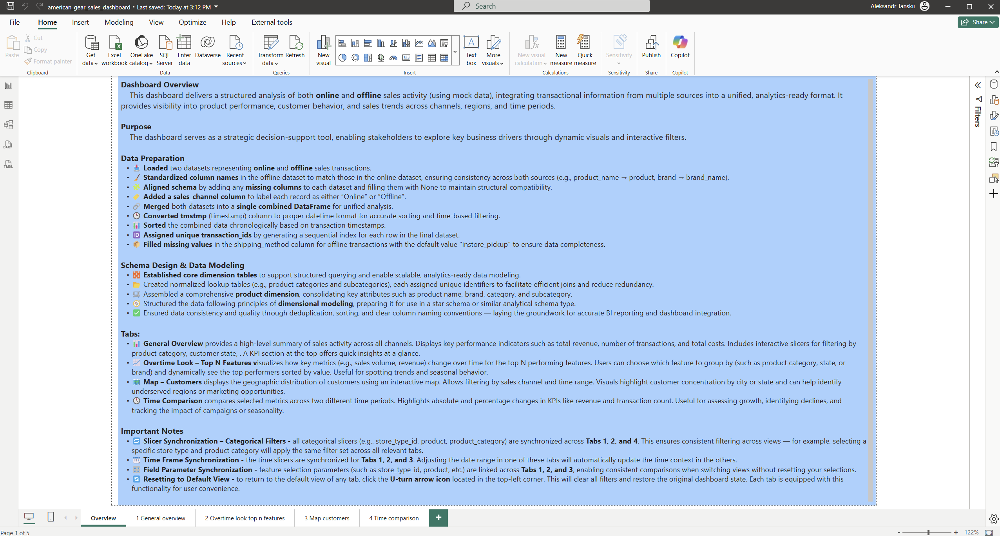

# 🧪 Sales Data Engineering Pipeline & Power BI Dashboard

This project demonstrates a complete data engineering flow — from raw data ingestion and transformation, to structured schema creation and a fully interactive Power BI dashboard.

> 🚀 Built using Python, Jupyter, and Power BI — with large files hosted externally.

---

## 📁 Project Structure

```
sales_data_pipeline_and_dashboard/
│
├── eda/                         # Exploratory data analysis
├── etl/                         # ETL notebook and transformation logic
├── schema/                      # schema design
├── dashboard/                   # Power BI report (.pbix)
├── data_links.txt               # Google Drive links to large files
└── README.md                    # This file
```

---

## 📌 Overview

This project focuses on integrating, transforming, and visualizing online and offline sales data to uncover business insights.

### ✅ Key Steps:

1. **Exploratory Data Analysis (EDA)** – examined trends, outliers, and structure of both datasets.
2. **Schema Design** – created dimension and fact tables for a clean snowflake schema.
3. **ETL Development** – unified datasets, cleaned and transformed data in Python.
4. **Power BI Dashboard** – loaded processed data and built a multi-tab dashboard.

---

## 🔧 Tools & Technologies

- `Python`, `pandas`, `Jupyter`
- `Power BI` for dashboarding
- `Git` for version control
- `Google Drive` for hosting files >100MB
- `Lucid` for building a schema

---

## 📊 Power BI Dashboard Tabs

- **General Overview** – key metrics with slicers and KPI cards
- **Overtime Look – Top N Features** – trends over time, sorted by top values
- **Map – Customers** – customer distribution by geography
- **Time Comparison** – side-by-side KPI comparison across time periods

---

## 🗃️ External Files

Due to GitHub's file size limits, some data and dashboard files are stored externally:

📁 **Google Drive Links**:  
- [📂 Raw Data Files](https://drive.google.com/drive/folders/1y32_yBZ7Jt886quNa23Fv18d1_yLPGQj?usp=sharing)  
- [📂 Processed Files for Dashboard](https://drive.google.com/drive/folders/1jdFFmQfAYFmaZvtysEJ_QzTMIvnVV-7c?usp=sharing)  
- [📊 Power BI Dashboard (.pbix)](https://drive.google.com/drive/folders/18etv8fZimipV4F7CzecVuoV_ZtyOwCtA?usp=sharing)

---

## 📈 Outcome

The final dashboard enables business users to:
- Track performance across sales channels
- Analyze customer and product trends
- Compare KPIs over time
- Drill down into geography-based insights

---

## 📬 Contact

Made with ❤️ by [@ATanskiy](https://github.com/ATanskiy)
---

## 📷 Dashboard Previews

Below are preview images of the Power BI dashboard tabs included in this project:

### 🧭 Dashboard Introduction
  
*A quick overview of the dashboard purpose, data preparation steps, schema design, and navigation tips across tabs.*

### 📌 General Overview Tab
  
*Shows aggregated sales performance, revenue, costs, customers, and transactions with key slicers for filtering across time, product, store, and channel dimensions.*

### 📈 Overtime Look – Top N Features
  
*Presents line charts of revenue and costs over time, split by payment methods. Useful for trend analysis and comparing top-performing segments.*

### 🗺️ Map – Customers
  
*Displays geographic distribution of customers across states and cities. Enables identifying regional opportunities or performance gaps.*

### ⏳ Time Comparison Tab
  
*Enables side-by-side comparison of key metrics (e.g., revenue, costs, transactions) between two custom date ranges. Great for evaluating campaign impact or seasonality.*
